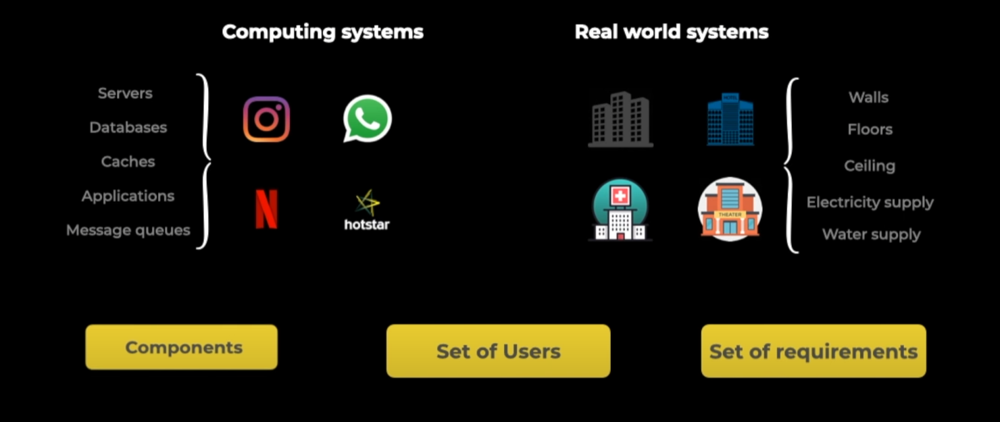
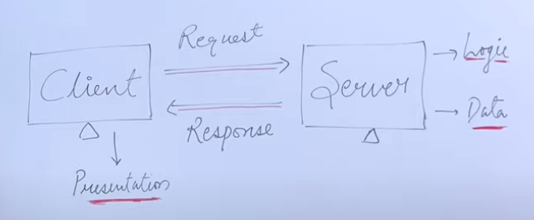

# System Design

- [System Design](#system-design)
  - [What is a system?](#what-is-a-system)
  - [What is design?](#what-is-design)
  - [Why system design?](#why-system-design)
  - [Components of system design](#components-of-system-design)
  - [Client-Server Architecture](#client-server-architecture)
  - [Proxies](#proxies)
  - [FYI](#fyi)

---

## What is a system?

A system is a loosely coupled term for an architecture or collection of software or technologies that communicate with each other/interact with each other in order to serve a set of users with a certain set of requirements.

Image credit: [Introduction to System Design | System Design Tutorials | Part 1 | 2020](https://youtu.be/FSR1s2b-l_I?list=PLTCrU9sGyburBw9wNOHebv9SjlE4Elv5a&t=146)

---

## What is design?

Design is a process of understanding the user requirements and selecting the components and modules and how they are going to be intertwine and communicating with each other to serve the need of the system.

---

## Why system design?

The whole process of system and design is very complicated. It needs knowledge of software and technologies etc in order to build successful large scale system.

- As a software engineer, one should know the components, the trade-offs the problems that have to be solved

---

## Components of system design

The components can be divided into two parts:

1) Logical entities
2) Tangible entities (Technology)

| Logical | Tangible |
|---------|----------|
| Data | Text, Images, Videos .. |
| Database | MongoDB, Postgres, MySql .. |
| Applications | Jave, Python, GoLang .. |
| Cache | Redis, Memcache .. |
| Message Queue | Kafka, RabbitMQ .. |
| Infra | AWS, GCP, Azure .. |
| Communication | APIs, Messages .. |
  
---

## Client-Server Architecture

Image credit: [Client Server Architecture | System Design Tutorials | Part 3 | 2020](https://youtu.be/Dg1U-jwVUrg?list=PLTCrU9sGyburBw9wNOHebv9SjlE4Elv5a&t=39)

| Thick Client | Thin Client |
| ------------ | ----------- |
| Client where majority of the logical manipulation happens on the client side e.g Outlook, Video Editing Softwares | Client where majority of the logical manipulation happens on the server side e.g. Streaming Services (Amazon Prime, Netflix) |

When to use different clients and tiers:

__Thin Client__ : E-commerce sites, streaming applications etc
__Thick Client__ : Gaming apps, Video editing software etc
__2 Tier__ : Light weight website for small businesses
__3 Tier__ : Basic library management for school
__N Tier__: Large scale systems (Gmail, FB)

---

## Proxies

Forward Proxy: Client Side Proxy (VPN)

Reverse Proxy: Server Side Proxy (Load Balancer)

---

Data and Data Flow

- Data is the core of system design

|Layer|Data|
|-----|----|
|Business layer| texts, videos, notes|
|Application layer|JSON/XML|
|Data Store (DBs)|tables, indexes, lists, trees|
|Network layer|data packets|
|Hardware Layer| 0's and 1's|

---

## FYI

- It is quite possible that the components of the two system looks same or the basic building blocks are same but design for two systems can be completely different. e.g design of a website that servers videos would be compeletely different from the one providing streaming services.

Ref:

- [System Design Tutorials BY Yogita Sharma](https://www.youtube.com/playlist?list=PLTCrU9sGyburBw9wNOHebv9SjlE4Elv5a)
